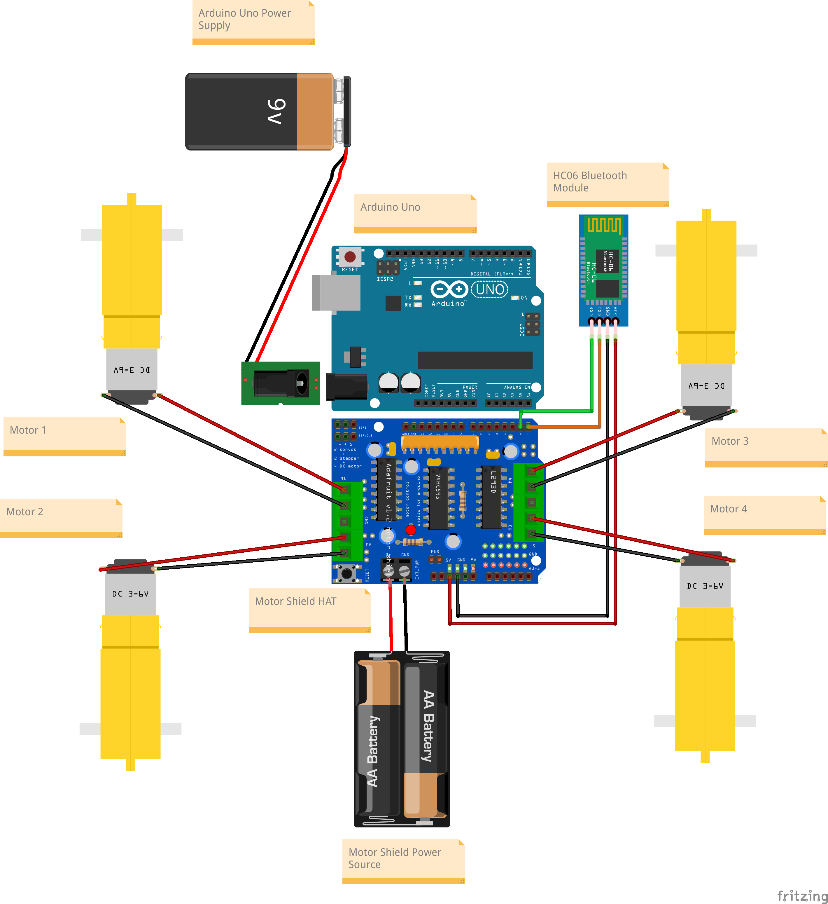

# PROJECT RORY: An AI Powered RC-Car That Is Controlled By Gestures

# Introduction

Project Rory is an innovative RC car powered by artificial intelligence, capable of interpreting and responding to hand gestures. This project combines hardware engineering with advanced software techniques to create a unique interactive experience.

- ## Hardware Components
    **See a more detailed breakdown [here](./hardware_parts.xlsx)**

    - Arduino UNO: The microcontroller of the RC car.
    - Adafruit Motor Shield (HAT): Used for driving up to 4 DC motors. (Hardware Attached on Top HAT)
    - HC-06 Bluetooth Module: Facilitates wireless communication between the car and the PC.
    - Motors: The car is equipped with four motors for movement.
    - Chassis
    - Dupont wires/ nuts & bolts, wheels etc
    ### Hardware Components
        Hardware parts interconnection
    

    
    

- ## Software Components

    - [OpenCV](https://opencv.org/): For processing the live video feed.
    - [MediaPipe](https://developers.google.com/mediapipe): Creates landmarks on hand objects for gesture recognition.
    - [PySerial](https://pypi.org/project/pyserial/): Communication Interface: Allows for command transmission from the PC to the RC car.
    - [Conda](https://docs.conda.io/projects/conda/en/stable/user-guide/getting-started.html): A managed Python environment running Python v3.9.16
    - [Arduino IDE](https://www.arduino.cc/en/software): An IDE to upload and interface with the Arduino while programming and testing.

- ## How It Works

    ### Video Processing 
    OpenCV captures a live video feed from the webcam capture object.
    

    
    

    ### Gesture Recognition
    Using MediaPipe, the system identifies hand landmark coordinates that are used to classify the gestures into predefined categories.
    
    ### Serial Communication
    The commands are serially sent over the Bluetooth Port and received by the Arduino that executes the commands received.

    ### Motion Control
    Upon receiving commands over the UART ports via Bluetooth, the pre-defined motor directions are executed.
    Direction is achieved by varying or manaining similar speeds across all motors producing a "tank" like movement.

- ## Usage

    Setup: Ensure all hardware components are correctly connected and powered.
    Software Installation: Install the necessary libraries and software on your PC.
    Bluetooth Pairing: Pair the HC-06 module with your PC.
    Running the Program: Execute the software to start the live video feed and gesture recognition.

    ### Code Implementation for this project.
    Load the [arduino code](./run_ard.ino) onto the arduino.
    Run the [python file](./run.py) on your pc and face the webcam
    Vary your hand gestures to show left, right, foward and stop

    *Foward* -  Open palm with fingers pointing up
    *Right*  -  Open palf with fingers pointing right
    *Left*   -  Open palm with fingers pointing left
    *Stop*   -  Closed fist
 
- ## License

  This project is licensed under the MIT License. See [here](./LICENSE).

- ## Acknowledgments

  Thanks to all contributors (in no particular order) who have helped in developing Project Rory.
  1. [Adrian Bikuri](https://github.com/AdrianMunene)
  1. [Taylor Omondi](https://github.com/Taylor-Omondi-Odhiambo)
  1. [Dominic Kimeu](https://github.com/kimeudom)
  1. [Terry Mukundi](https://github.com/SonnyKundi)
  1. [Ruai Dak](https://github.com/ruai-dak)
  1. [Neville Kalunda](https://github.com/kalundaah)

  Special thanks to the open-source communities of Arduino, Adafruit, OpenCV, and MediaPipe.